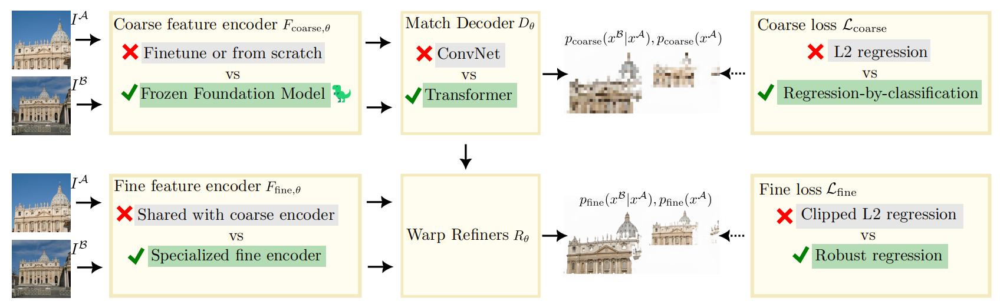
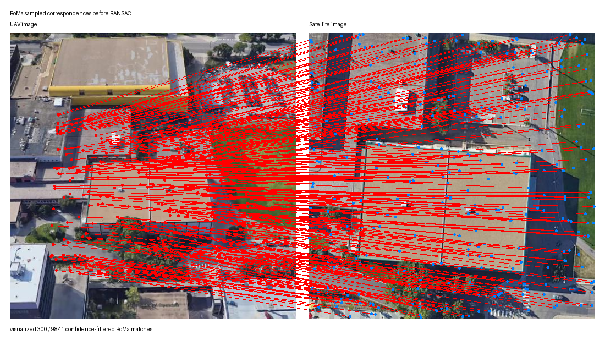
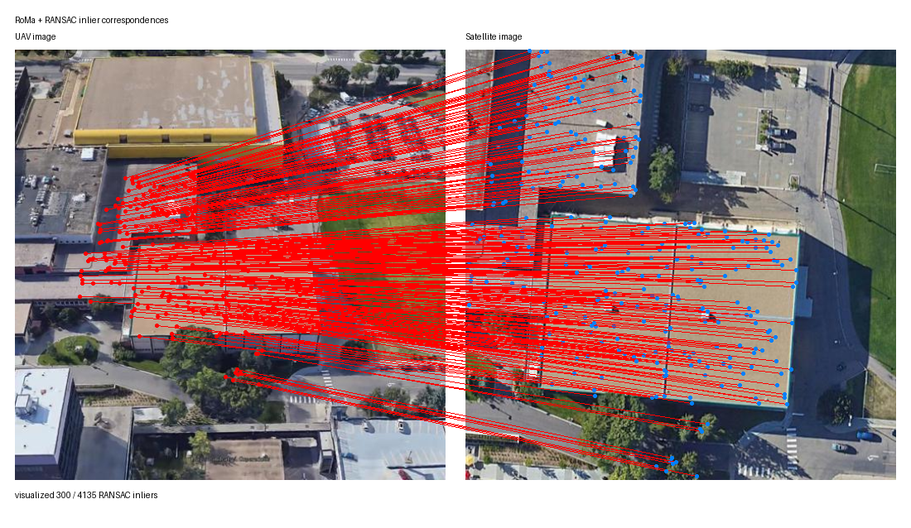
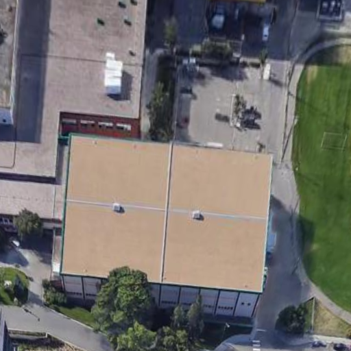
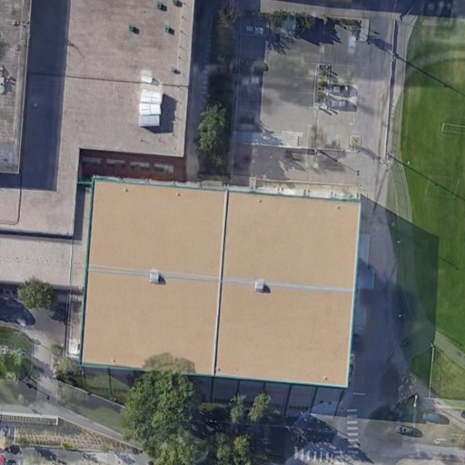

# DRIFT

基于稠密特征匹配的遥感图像配准方法研究。DRIFT（Dense RoMa Image Feature Transformation）面向无人机图像与卫星图像之间的跨视角配准任务，使用 RoMa 提取稠密匹配点，并结合 Top-K 匹配点筛选与 RANSAC 单应性估计完成图像配准。

## 1. 项目简介

无人机图像与卫星图像之间通常存在尺度差异、视角差异、光照差异和局部遮挡等问题。传统特征方法（如 SIFT、ORB）在跨视角遥感图像中容易出现匹配点数量不足、重复纹理误匹配和空间覆盖不均匀等问题。深度局部特征方法（如 LightGlue）通常依赖稀疏特征点输入，适合具有较多稳定局部纹理的图像，但在低纹理、重复结构或跨域遥感图像中仍可能受限。DRIFT 采用 RoMa 生成稠密对应关系，再通过 Top-K 选择高置信度匹配点，并利用 RANSAC 剔除几何外点，最终估计无人机图像到卫星图像的单应性矩阵。

整体流程如下：

1. 输入无人机图像和卫星图像；
2. 使用 RoMa 进行稠密特征匹配，得到候选匹配点及置信度；
3. 根据置信度进行 Top-K 匹配点筛选；
4. 使用 RANSAC 估计 UAV → Satellite 的单应性矩阵；
5. 计算平均匹配点数、平均内点数、平均内点率和平均重投影误差；
6. 根据单应性矩阵将无人机图像变换到卫星图像坐标系，并生成可视化结果。

## 2. 方法流程图与可视化结果



**RoMa 稠密匹配流程示意图**



**RANSAC 前的 RoMa 采样匹配点**



**RANSAC 后保留的内点匹配**



**无人机图像变换到卫星图像坐标系的结果**



**无人机图像配准到卫星图像后的叠加效果**

## 3. 环境配置

```bash
conda create -n roma python=3.10
conda activate roma
pip install -e .
```

## 4. 数据组织方式

将无人机图像和卫星图像分别放入两个文件夹，并保证排序后能够一一对应：

```text
data/
├── uav/
│   ├── 0001.jpg
│   ├── 0002.jpg
│   └── ...
└── sat/
    ├── 0001.jpg
    ├── 0002.jpg
    └── ...
```

首先下载University-1652数据集

接下来处理成如上文件结构（默认 `--num_pairs 1000`）

```bash
python load.py --src_root /path/to/University-1652
```

## 5. 运行方法

### 5.1 单对图像配准

```bash
python demo/demo_match.py --uav_path uav.jpg --sat_path sat.jpg
```

输出结果包括：

```text
matches_all.png          RANSAC 前的 RoMa 采样匹配点
matches_inliers.png      RANSAC 后的内点匹配点
warped_uav_to_sat.png    变换到卫星坐标系的无人机图像
warped_overlay.png       配准后的叠加图
registration_result.png  论文展示用综合结果图
homography.txt           UAV → Satellite 单应性矩阵
statistics.txt           匹配点和 RANSAC 统计结果
```

### 5.2 批量运行 RoMa + Top-K + RANSAC

```bash
python demo/batch_pairs.py --uav_dir data/uav --sat_dir data/sat --num_matches 2000 --ransac_thr 5.0 
```

如需保存每一对图像的可视化结果，可以添加 `--save_vis`

### 5.3 对比实验

```bash
python demo/batch_sift_ransac.py --uav_dir data/uav --sat_dir data/sat
python demo/batch_orb_ransac.py  --uav_dir data/uav --sat_dir data/sat
python demo/batch_lightglue_pairs.py --uav_dir data/uav --sat_dir data/sat --features superpoint
python demo/batch_lightglue_pairs.py --uav_dir data/uav --sat_dir data/sat --features disk
```

## 6. 评价指标

| 指标 | 含义                                       |
|---|------------------------------------------|
| 平均匹配点数 | 每对图像中进入统计或 RANSAC 的平均匹配点数量               |
| 平均内点数 | RANSAC 后满足几何一致性的平均内点数量                   |
| 平均内点率 | 平均内点数 / 平均匹配点数，用于衡量匹配点集合的几何一致性           |
| 平均重投影误差 / px | 使用估计单应性矩阵将 UAV 点投影到卫星图像后，与对应卫星点之间的平均像素距离 |

## 7. 实验结果

### 7.1 特征提取方法参数对比

| 方法                         |        参数量 |
|----------------------------|-----------:|
| LightGlue                  |      ~0.1M |
| **Disk + LightGlue**       | **~13.7M** |
| **Superpoint + LightGlue** |  **~1.4M** | 
| **RoMa**                   | **~60.5M** |
| Tiny RoMa                  |      ~2.8M |

尽管标准版RoMa参数量较大（约60.5M），但其在剧烈视角变化与重复纹理等挑战性场景下取得了最优匹配精度，展现出很高的实用价值。

### 7.2 对比实验

| 方法                              |      平均匹配点数 |      平均内点数 |      平均内点率 | 平均重投影误差 / px |
|---------------------------------|------------:|-----------:|-----------:|-------------:|
| SIFT + RANSAC                   |       30.05 |       9.05 |     29.37% |     **1.07** |
| ORB + RANSAC                    |       30.10 |      10.15 |     32.94% |         1.18 |
| Superpoint + LightGlue + RANSAC |      418.45 |     168.50 |     39.08% |         2.32 |
| Disk + LightGlue + RANSAC       |      319.90 |     134.55 |     40.50% |         2.31 |
| RoMa + Top-K + RANSAC           | **1958.20** | **820.30** | **41.84%** |         1.72 |

与传统特征方法相比，RoMa + Top-K + RANSAC 在匹配数量和内点数量上具有明显优势。相较于 SIFT + RANSAC，RoMa 方法的平均匹配点数约为其 65.16 倍，平均内点数约为其 90.64 倍；相较于 ORB + RANSAC，RoMa 方法的平均匹配点数约为其 65.06 倍，平均内点数约为其 80.82 倍。

与深度局部特征方法相比，RoMa + Top-K + RANSAC 在各评价指标上均有优势。相较于 Disk + LightGlue + RANSAC，RoMa 方法的平均匹配点数约为其 6.12 倍，平均内点数约为其 6.09 倍,平均重投影误差减小了 0.59 px；相较于 Superpoint + LightGlue + RANSAC，RoMa 方法的平均匹配点数约为其 4.68 倍，平均内点数约为其 4.87 倍,平均重投影误差减小了 0.60 px。

这说明稠密匹配方法更适合无人机—卫星跨视角图像配准任务，能够提供更充分的空间覆盖。

需要注意的是，SIFT 和 ORB 的平均重投影误差分别为 1.07 px 和 1.18 px，低于 RoMa + Top-K + RANSAC 的 1.72 px。这并不代表传统方法整体配准效果更好，因为传统方法只保留了极少量匹配点，其误差统计主要来自少数较稳定的局部匹配点；而RoMa方法保留了更多跨区域的稠密内点，能够为全局配准提供更强的鲁棒性和更丰富的空间约束。因此，在无人机—卫星图像配准中，RoMa + Top-K + RANSAC 在匹配覆盖范围和几何一致性方面更具优势。

### 7.3 Top-K 匹配点筛选消融实验（ransac_thr = 5.0）

| 方法                        |  匹配点筛选 K |      平均匹配点数 |      平均内点数 |      平均内点率 | 平均重投影误差 / px |
|---------------------------|---------:|------------:|-----------:|-----------:|-------------:|
| RoMa + Top-K + RANSAC     |      500 |      493.05 |     211.75 |     42.89% |         1.69 |
| RoMa + Top-K + RANSAC     |     1000 |      983.20 |     407.40 |     41.38% |         1.74 |
| **RoMa + Top-K + RANSAC** | **2000** | **1958.20** | **820.30** | **41.84%** |     **1.72** |
| RoMa + Top-K + RANSAC     |     5000 |     4893.55 |    1992.80 |     40.68% |         1.76 |

Top-K 消融实验表明，随着 K 值增大，平均匹配点数和平均内点数同步增加。K=500 时平均内点率最高，为 42.89%，但平均内点数只有 211.75，空间覆盖不足，可能影响单应性估计的稳定性。K=5000 时平均内点数最高，达到 1992.80，但需要处理更多匹配点，平均内点率略降至 40.68%，平均重投影误差也略升至 1.76 px。

综合考虑计算量、内点数量和配准误差，K=2000 是较合适的默认设置。该设置下平均匹配点数为 1958.20，平均内点数为 820.30，平均内点率为 41.84%，平均重投影误差为 1.72 px，能够在较低匹配点数量下保持稳定的配准效果。

### 7.4 RANSAC 阈值消融实验（num_match = 2000）

| 方法                        | RANSAC 阈值 / px |      平均匹配点数 |      平均内点数 |      平均内点率 | 平均重投影误差 / px |
|---------------------------|---------------:|------------:|-----------:|-----------:|-------------:|
| RoMa + Top-K + RANSAC     |              1 |     1959.40 |     351.90 |     17.92% |         0.48 |
| RoMa + Top-K + RANSAC     |              3 |     1960.30 |     673.85 |     34.33% |         1.20 |
| **RoMa + Top-K + RANSAC** |          **5** | **1958.20** | **820.30** | **41.84%** |     **1.72** |
| RoMa + Top-K + RANSAC     |             10 |     1960.95 |    1031.50 |     52.57% |         3.38 |

RANSAC 阈值决定了匹配点被判定为内点的宽松程度。阈值为 1 px 时筛选最严格，平均重投影误差最低，仅为 0.48 px，但平均内点率只有 17.92%，内点数量不足。随着阈值增大到 3 px 和 5 px，平均内点数由 673.85 增加到 820.30，平均内点率由 34.33% 提升到 41.84%，说明适当放宽阈值有助于保留更多有效匹配。

当阈值增大到 10 px 时，平均内点率进一步提升到 52.57%，但平均重投影误差升高到 3.38 px，说明过大的阈值会将更多误差较大的点纳入内点集合，降低配准精度。因此，本实验选择 5 px 作为默认 RANSAC 阈值，在内点数量和重投影误差之间取得较好的折中。

### 7.5 模块消融实验

| 方法 | RoMa | Top-K 筛选 | RANSAC | 平均匹配点数 | 平均内点数 |      平均内点率 | 平均重投影误差 / px |
|---|---:|---------:|---:|---:|---:|-----------:|-------------:|
| RoMa | √ |        × | × | 9782.75 | 1141.15 |     11.63% |         3.30 |
| RoMa + RANSAC | √ |        × | √ | 9778.65 | 4047.95 |     41.35% |     **1.72** |
| RoMa + Top-K | √ |        √ | × | 1963.30 | 227.15 |     11.53% |         3.30 |
| RoMa + Top-K + RANSAC | √ |        √ | √ | 1958.20 | 820.30 | **41.84%** |     **1.72** |

从模块消融结果可以看出，单独使用 RoMa 能够生成大量稠密匹配点，平均匹配点数达到 9782.75，但其中存在较多外点，平均内点率仅为 11.63%，平均重投影误差为 3.30 px。加入 RANSAC 后，平均内点率提升到 41.35%，平均重投影误差降低到 1.72 px，说明 RANSAC 对跨视角遥感图像中的误匹配具有明显的剔除作用。

Top-K 筛选的主要作用是减少进入后续几何估计的匹配点数量。RoMa + Top-K 将平均匹配点数从 9782.75 降低到 1963.30，但在不使用 RANSAC 的情况下，平均内点率仍只有 11.53%，平均重投影误差仍为 3.30 px，说明仅依靠置信度筛选不能替代几何一致性验证。RoMa + Top-K + RANSAC 在仅保留约 20% 匹配点的情况下，仍取得 41.84% 的平均内点率和 1.72 px 的平均重投影误差，说明该组合能够在匹配数量、计算效率和配准精度之间取得较好的平衡。

## 8. 实验结论

1. **RoMa 提供了充足的稠密候选匹配点。** 相比 SIFT、ORB 和 LightGlue，RoMa 能够在跨视角遥感图像中获得更多匹配点和内点，为后续单应性估计提供更充分的几何约束。
2. **RANSAC 是提升配准质量的关键模块。** 仅使用 RoMa 或 RoMa + Top-K 时，平均内点率约为 11%，而加入 RANSAC 后平均内点率提升到 41% 左右，平均重投影误差由 3.30 px 降低到 1.72 px。
3. **Top-K 筛选主要提升计算效率。** Top-K 能够显著减少匹配点数量，同时在配合RANSAC时保持接近全量匹配的配准精度。
4. **RANSAC 阈值需要折中选择。** 阈值过小会导致内点不足，阈值过大会引入误差较大的点。本实验中 5 px 是较合适的默认阈值。
5. **最终推荐配置为 RoMa + Top-K(K=2000) + RANSAC(ransac_thr=5.0)。** 该配置在平均匹配点数、平均内点数、平均内点率和平均重投影误差之间取得了较好的平衡。

## 9. 项目结构

```text
DRIFT/
├── demo/
│   ├── demo_match.py              # 单对 UAV-Satellite 图像配准
│   ├── batch_pairs.py             # 批量 RoMa + Top-K + RANSAC 实验
│   ├── batch_sift_ransac.py       # SIFT + RANSAC 对比实验
│   ├── batch_orb_ransac.py        # ORB + RANSAC 对比实验
│   └── batch_lightglue_ransac.py  # Superpoint + LightGlue + RANSAC 及 Disk + LightGlue + RANSAC 对比实验
├── data/
│   ├── uav/                       # 无人机图像
│   └── sat/                       # 卫星图像
├── figs/                          # README 与论文插图
├── result/                        # 实验输出结果
├── load.py                        # 处理数据集
└── README.md
```

## 10. 创新点

1. 针对无人机—卫星跨视角图像配准任务，设计了一种基于RoMa稠密匹配、Top-K高置信度筛选和RANSAC几何验证的轻量级配准流程，无需重新训练模型即可完成稳定配准。

2. 在RoMa输出的大量稠密匹配点基础上，引入Top-K筛选策略，有效减少参与几何估计的候选匹配点数量，在保证配准精度的同时提高了计算效率，并通过消融实验验证了其有效性。

3. 构建了针对无人机—卫星图像配准的实验评价体系，从匹配点数量、内点数量、内点率、重投影误差及可视化结果等多个维度，对Top-K参数和RANSAC阈值进行了系统分析，为跨视角遥感图像配准参数选择提供了实验依据。 /path/to/University-1652
```
